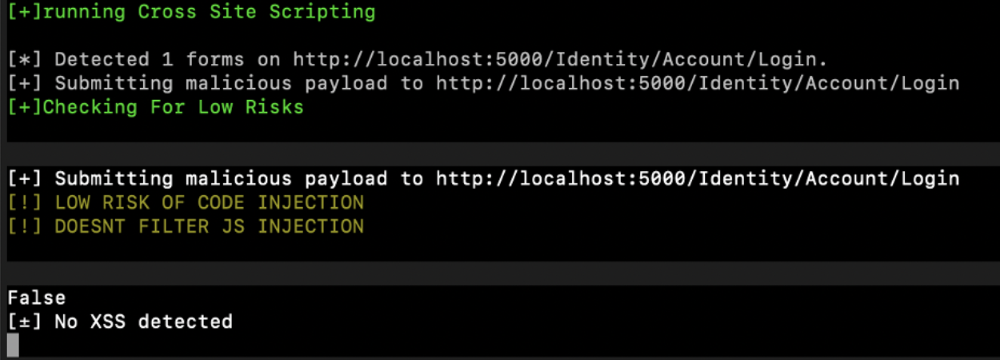

# BUGS
```
_______________________________________________________________________________________________|
----------------------------------------------------------------------------------------------||
          ()  \                                                                               ||
         (  )    \                                                                            ||
        (    )       \                                                                        ||
       (      )          \                                                                    ||
      (        )             \                                                                ||
      (        )                \                                                             ||
      (        )\                   \                                                         ||
       (      )     \                   \                                                     ||
         ____           \                   \                                                 ||
         |  |               \                   \                                             ||
         |  |                    \                  \                                         ||
         |  |                        \                  \                                     ||
         |  |                           \                   \                                 ||
         |  |                               \                   \                             ||
         |__|                                   \                   \                         ||
       /______ \                                      \                 \                     ||
                                                                                              ||
                                                                   (   )                      ||
                                                            \   (  O   O   )   /              ||
                                                             \(      |       )/               ||
                                                             (   ()  |   ()   )               ||
                                                             (       |        )               ||
                                                              (  ()  |   ()  )                ||
                                                             /  (    |     )  \               ||
                                                            /     (-----)       \             ||
zzzzzzzzzzzzzzzzzzzzzzzzzzzzzzzzzzzzzzzzzzzzzzzzzzzzzzzzzzzzzzzzzzzzzzzzzzzzzzzzzzzzzzzzzzzzzzzz
                                                 o
           ########       **       **           /|\        *=========+*
           ##       #     **       **          / | \      ==
           ##       #     **       **         |  |  |     ==
           ##      #      **       **         | / \ |     ==    ========
           ###### #       **       **         | / \ |     ==    ========
           ##      #      **       **         |/   \|     ==          ==
           ##       #     **       **         /\   /\     ==          ==
           ##      #      ***********        /__|_|__\_   ==          ==
           #######        ***********       |__|__|___|     *=========*
```
# Description
<p align="center">

</p>

this is an automated tool used to scan a simple web application for vulnerabilities, mostly rest APIs.
The tool is scanning each end point for vulnerabilities.
To use the tool make sure that all the files are in the same directory and run the file `Main.py`. The tools scans for:
- SQL injection 
- Cross site scripting
- Random input poisoning

# Usage 
The tool takes a command from the <a href="##Options">Options</a> and applies it on the target URL. 
Check the <a href="#Example">Examples</a> for a better idea.
```commandline
[Options]{URL}
```
## Options
```commandline
-h : More information
-q : Quit the tool
-s : SQL injection scan 
-x : XSS Scan 
-i : Random Input Scan

```
# Example
## SQL injection scan :
```commandline
-s http://WebsiteName
```
<p align="center">

</p>

## XSS scan :
```commandline
-x http://WebsiteName
```
<p align="center">

</p>

## Random Input scan :
```commandline
-i http://WebsiteName
```
<p align="center">

</p>

## More information
```commandline
-h
```
<p align="center">

</p>